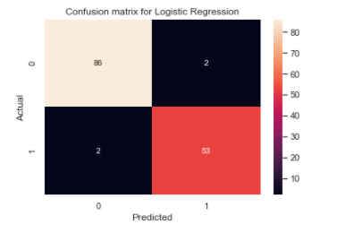

# Breast Cancer Predicton

 

## Problem Definition
Breast cancer is the cancer of cells in breast. Worldwide breast cancer is the leading type of cancer in women, accounting for 25% of all cases.  It is the second most common cancer diagnosed among women in United States. It can occur both in Men and Women but its far more common among women. Over the years, because of advancement in diagnosis and treatment, survival rate in breast cancer have increased and number of deaths associated with breast cancer have declined. Early detection means using an approach that helps breast cancer get diagnosed earlier in the timeline before the disease becomes aggressive. Breast cancer awareness and screening are the two main components which would aid in timely diagnosis and treatment. 
Cells affected by cancer are called malignant cells. Malignant cells are different from normal cells in the body in that they divide very rapidly and invade surrounding tissues. When they divide at an accelerated rate, they often form a mass of tissue called a tumor. Sometimes cells multiply and form tumor without spreading to surrounding tissues and the tumor is not cancerous, those are called benign cells.

The objective of the study was to predict if the patient had benign or malignant tumor on the basis of numerical measurements of cellular images.  

## Project Motivation

As Breast cancer is one of the leading cause of cancer globally, the aim of this study was to address following questions,

1. How do benign and malignant tumor cells differ in their sizes?

2. Do the symmetry and texture of tumor cells have any role in their malignancy?

3. What is the accuracy of these models in diagnosing breast cancer tumors ?

## Requirements

Libraries needed for the notebook to run were,

1. pandas === 1.1.3
2. numpy == 1.19.2
3. matplotlib == 3.3.2
4. scikit-learn === 0.23.2
5. seaborn == 0.11.0

## Files in the Repository

 1.Breast_Cancer_Prediction.ipynb : Jupyter notebook containing the  project
 2. Images : Folders containing images for Readme file.
 3. data.csv : CSV file containing all data

## Results:

Please find analysis in a blog post https://jayashar.medium.com/breast-cancer-diagnosis-through-the-lens-of-machine-learning-d50cf505c00f

## Data Collection

The dataset is taken from Wisconsin Breast Cancer database from UCI machine learning repository https://archive.ics.uci.edu/ml/datasets/Breast+Cancer+Wisconsin+%28Diagnostic%29

The breast cancer database was obtained from the University of Wisconsin Hospital and it contains 569 instances and 32 variables.  

Attribute Information:

1) ID number
2) Diagnosis (M = malignant, B = benign)
3-32)

Ten real-valued features are computed for each cell nucleus:

a) radius (mean of distances from center to points on the perimeter)
b) texture (standard deviation of gray-scale values)
c) perimeter
d) area
e) smoothness (local variation in radius lengths)
f) compactness (perimeter^2 / area - 1.0)
g) concavity (severity of concave portions of the contour)
h) concave points (number of concave portions of the contour)
i) symmetry
j) fractal dimension ("coastline approximation" - 1)

The mean, standard error, and "worst" or largest (mean of the three
largest values) of these features were computed for each image,
resulting in 30 features.  For example, field 3 is Mean Radius, field
13 is Radius SE, field 23 is Worst Radius.

### Clean Data
 This dataset was pretty clean. Dataset did not have duplicates or null values.
### Observations:
The data has 569 rows and 32 columns.

There are 31 numerical features (30 float types and 1 int) and 1 categorical.

Diagnosis is the target variable.

There are no features with null values and there are no duplicated records.

## Exploratory Data Analysis

### Observations:
For several variables (like mean of cell radius, perimeter, concavity, area, compactness and concave points), larger values showed correlation with malignant diagnosis.

Mean of smoothness, symmetry, texture and fractal dimension did not show specific preference for one diagnosis than to another.

As we were comparing all the variables in the dataset, we found several features were correlated. And we dropped :['perimeter_mean', 'area_mean', 'perimeter_se', 'area_se', 'radius_worst', 'perimeter_worst', 'area_worst'].

## Model Development AND Best Model Selection

After splitting training and test dataset we created machine learning model in training set and then tested in test dataset. Following models were used.

Logistic Regression : Easier and simpler and very efficient to train.
Logistic Regression with Hyperparameter tunning.
Random Forest Classifier : Random forest is robust, accurate, efficient and relatively quick to develop.

Above  models were trained, tested and evaluated. Metrics used for this analysis was Accuracy and Recall value. In machine learning our goal is to minimize Type I (FP) and Type II errors (FN). In an ideal case, a perfect model should have none of these errors. However, this is not possible in real world and we must balance between precision and recall. Even though, in the models we have tested, Accuracy was 97% in both Random Forest and Logistic Regression, Logistic Regression was chosen as a best model because it maximized the Recall value. Still, there were 2 False negative predictions in our best prediction which was lower than in Random Forest. In this scenario, we prefer a model which would minimize false negatives hence helping us to not miss cancers which require intensive treatment as soon as they are diagnosed. 

## References
1. https://th.bing.com/th/id/R723ed7f0e95e83a2efa4853acd13978e?rik=s2%2b0Bo%2fCCmqdsQ&riu=http%3a%2f%2fimages.medicinenet.com%2fimages%2fquiz%2fbreast-cancer%2fbreast-cancer-s-6.jpg&ehk=JrPYGsFg%2fZGv976FHQ%2b%2b7mRHUwjGYgMCokKJ6iFtDAo%3d&risl=&pid=ImgRaw
